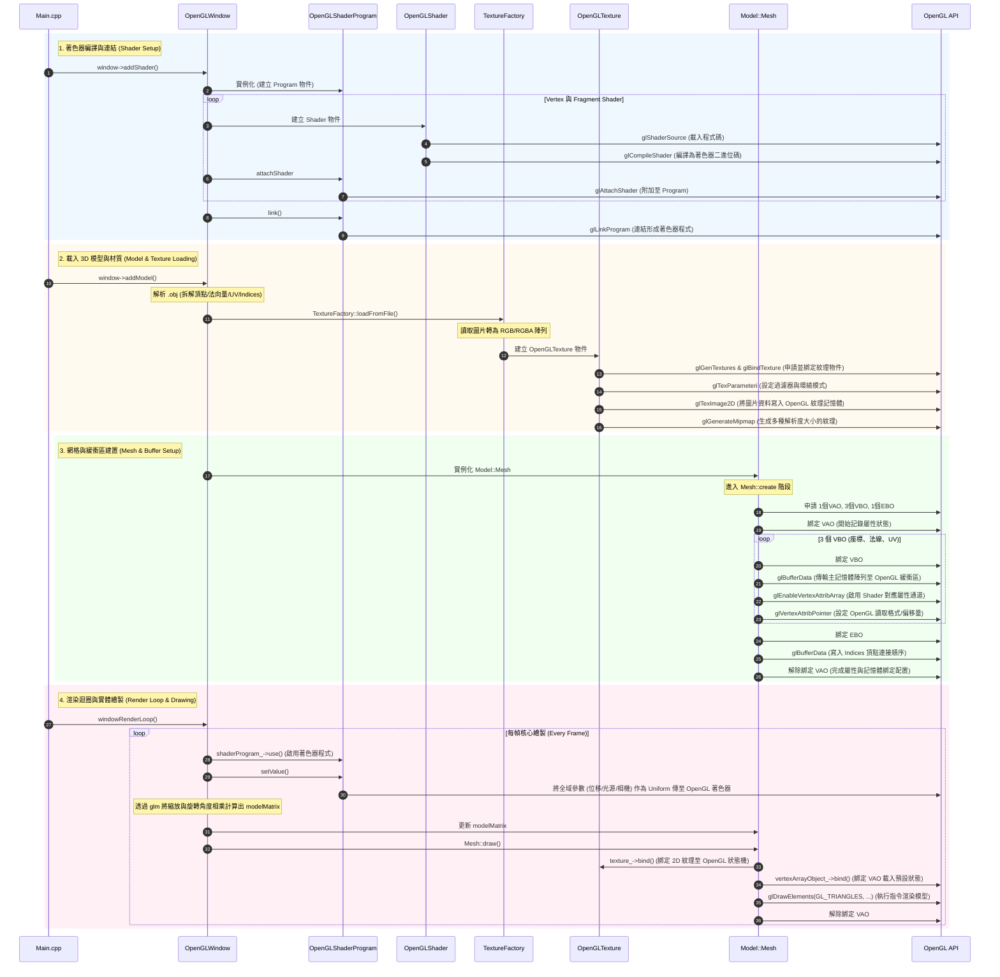

# HW1 報告

## 1. 環境
- Windows 11
- Visual Studio 2022
- GLFW version 3.4.0

---

## 2. 方法說明

透過物件導向之方式，將 OpenGL 底層之 C API 進行封裝。以下為各核心類別中實作方法之運作邏輯說明：

### OpenGLBufferObject (VBO / EBO)
* **`create()`**：呼叫 `glGenBuffers` 向 OpenGL 申請一組新的緩衝區 (Buffer) 記憶體識別碼。
* **`bind()` / `release()`**：呼叫 `glBindBuffer` 將此緩衝區綁定至當前 OpenGL 狀態機（綁定為 0 則為解除綁定），指示 OpenGL 後續之資料操作皆針對此緩衝區進行。
* **`allocateBufferData()`**：呼叫 `glBufferData` 將主記憶體端之陣列資料（例如頂點座標、法向量等）正式傳輸並複製至 OpenGL 顯示記憶體中。
* **`tidy()`**：呼叫 `glDeleteBuffers` 釋放已配置之顯示記憶體空間。

### OpenGLVertexArrayObject (VAO)
* **`create()`**：呼叫 `glGenVertexArrays` 申請一個 VAO 識別碼，用於記錄 VBO 之資料格式配置與屬性連結狀態。
* **`bind()` / `release()`**：呼叫 `glBindVertexArray` 綁定（或解除綁定）該 VAO。綁定後，後續對 VBO 的操作與頂點屬性格式設定皆會被完整記錄於此 VAO 物件中。

### OpenGLShader 與 OpenGLShaderProgram (Shader)
* **`compileFromSource()`**：呼叫 `glShaderSource` 載入 GLSL 原始碼，並透過 `glCompileShader` 將其編譯為 OpenGL 可執行之著色器二進位碼。
* **`create()` / `attachShader()`**：呼叫 `glCreateProgram` 建立著色器程式物件，並透過 `glAttachShader` 將編譯完成之 Vertex Shader 與 Fragment Shader 附加至該程式物件中。
* **`link()` / `use()`**：呼叫 `glLinkProgram` 將各個著色器連結為完整的渲染管線，並於正式繪製前呼叫 `glUseProgram` 啟用該著色器程式以進行算繪。
* **`enableAttributeArray()` / `mapAttributePointer()`**：呼叫 `glEnableVertexAttribArray` 啟用頂點屬性通道，並透過 `glVertexAttribPointer` 設定 OpenGL 讀取 VBO 資料的規則（包含讀取之浮點數數量、資料間距與偏移量等）。此屬性配置過程會由當前綁定之 VAO 進行記錄。

### OpenGLTexture
* **`bindBuffer()`**：核心實作首先呼叫 `glBindTexture` 綁定紋理目標，接著使用 `glTexParameteri` 設定紋理之放大/縮小過濾器與環繞模式 (Wrap Option)。隨後呼叫 `glTexImage2D` 將主記憶體中解析完畢之圖片 RGB/RGBA 位元組資料傳輸至 OpenGL 紋理記憶體中，最後呼叫 `glGenerateMipmap` 生成  Mipmap 以提升渲染效能與視覺品質。

---

## 3. 程式執行

```bash
.\Homework01.exe "resources/model/Utah_teapot_(solid)_texture.obj" "resources/texture/uv.png" "Shader/BasicVertexShader.vs.glsl" "Shader/BasicFragmentShader.fs.glsl"
```

---

## 4. 程式流程

### 1. 著色器編譯與連結
* **啟動建置**：程式於 `Main.cpp` 中呼叫 `window->addShader()`，以啟動 OpenGL 渲染管線的建置。
* **讀取原始碼**：底層將實例化 `OpenGLShaderProgram` 物件，並分別讀取指定的 **Vertex Shader** 與 **Fragment Shader** 原始碼檔案。
* **編譯著色器**：針對每一份原始碼，程式建立 `OpenGLShader` 物件，呼叫 `glShaderSource` 載入程式碼，接著呼叫 `glCompileShader` 將其編譯為 OpenGL 可執行之著色器。
* **連結渲染管線**：編譯完成的 `OpenGLShader` 物件會透過 `glAttachShader` 附加至 Program 上，最後呼叫 `glLinkProgram` 進行連結，建立完整的**著色器程式 (Shader Program)** 以供後續渲染階段使用。

### 2. 載入 3D 模型與材質
* **解析模型資料**：程式接著呼叫 `window->addModel()` 讀取並解析外部的 `.obj` 模型檔案，將其拆解為**頂點座標 (Positions)**、**法向量 (Normals)**、**紋理座標 (Texture Coordinates)** 與**頂點連接順序 (Indices)** 等陣列資料。
* **讀取貼圖檔案**：若使用者有提供貼圖路徑，程式將呼叫 `TextureFactory::loadFromFile()`，讀取圖片檔案並轉換為 RGB/RGBA 位元組陣列。
* **建立 OpenGL 紋理**：隨後建立 `OpenGLTexture` 物件，透過 `glGenTextures` 與 `glBindTexture` 申請並綁定紋理物件，接著使用 `glTexParameteri` 設定過濾器與環繞模式 (`GL_REPEAT`)，再呼叫 `glTexImage2D` 將圖片資料正式寫入 OpenGL 紋理記憶體中。

### 3. 網格與緩衝區建置
* **配置緩衝區物件**：將解析完成之模型資料與材質傳入 `Model::Mesh` 進行實例化。於 `Mesh::create` 階段，程式會申請 1 個 **VAO**、3 個 Array Buffer 類型的 **VBO** (分別儲存座標、法向量、UV)，以及 1 個 Element Array Buffer 類型的 **EBO** (儲存 Indices)。
* **寫入頂點資料**：程式首先綁定 VAO 以開始記錄後續的屬性與狀態變更，接著依序綁定 3 個 VBO，呼叫 `glBufferData` 將主記憶體端的陣列資料傳輸至 OpenGL 緩衝區物件中。
* **設定屬性通道**：資料寫入後，針對每個 VBO 呼叫 `glEnableVertexAttribArray` 啟用 Shader 的對應屬性通道，並透過 `glVertexAttribPointer` 設定 OpenGL 讀取該緩衝區資料的格式 (如偏移量、資料型態)。
* **寫入連接順序與封裝**：最後綁定 EBO 並寫入頂點連接順序，隨後解除綁定 VAO。至此，該模型的所有屬性設定與記憶體綁定狀態皆已完整配置於 VAO 中，具備渲染條件。

### 4. 渲染迴圈與實體繪製
進入 `windowRenderLoop()` 後，每幀的核心繪製邏輯聚焦於矩陣運算、著色器狀態切換以及底層的 API 繪製指令呼叫，具體流程如下：

* **啟動著色器與傳遞全域變數**：首先呼叫 `shaderProgram_->use()` 啟用已連結之著色器程式。接著透過實作之 `setValue` 方法，將與模型本身幾何無關的**全域參數**（例如：計算所得之*紋理偏移量*、*光源位置*、*光源顏色*與*攝影機位置*）作為 Uniform 變數傳送至 OpenGL 著色器中。
* **計算模型矩陣**：針對場景中的模型，利用 `glm` 函式庫，將 UI 介面控制之縮放比例 (`scale_`) 與隨時間累加之旋轉角度 (`currentRotationAngle_`) 依序進行矩陣相乘，產生最新之 `modelMatrix` 並更新至 `Mesh` 物件中。
* **紋理與材質綁定**：進入 `Mesh::draw()` 繪製階段。呼叫 `texture_->bind()` 將 2D 紋理綁定至當前 OpenGL 狀態機，以供 Fragment Shader 進行色彩採樣。
* **綁定 VAO 並執行繪製指令**：最後呼叫 `vertexArrayObject_->bind()` 綁定專屬於該模型的 **VAO**，使 OpenGL 套用預先配置好的 VBO 與 EBO 狀態。緊接著執行 `glDrawElements(GL_TRIANGLES, ...)` 指令，OpenGL 將依據 EBO 紀錄的三角形頂點順序，於螢幕上渲染出 3D 模型。繪製完成後，解除綁定 VAO 以恢復預設狀態。

### 時序圖：



---

## 5. 加分項（Bonus）

### 1. 滑鼠移動視角
實作自由視角控制功能。於 `processInput()` 函式中捕捉滑鼠**中鍵**之拖曳事件，計算滑鼠之 X、Y 軸位移量，並將其轉換為 Yaw 與 Pitch。隨後利用三角函數計算出最新之攝影機前方向量，以實現平滑之視角轉動與觀測方向更改。

### 2. 鍵盤移動鏡頭
整合 **WASD** 鍵盤移動功能。透過外積計算出攝影機之右方向量，並搭配每幀之設定移動速度，使使用者能透過鍵盤輸入，於三維空間中進行攝影機座標之前後左右平移操作。

### 3. 模型縮放
於 ImGui 介面新增模型縮放控制參數。程式於每幀算繪時，擷取該數值並透過 `glm::scale` 函式產生等比例縮放矩陣，將其與模型矩陣 (Model Matrix) 相乘，藉此動態調整並更新模型於世界座標系中之顯示尺寸。

### 4. 模型旋轉
實作模型自動旋轉功能。為確保旋轉速率平穩不受幀率波動影響，並支援動態啟停功能，系統採用 Delta Time 進行旋轉角度之累加。隨後透過 `glm::rotate` 函式將此角度轉換為旋轉矩陣，使模型能沿特定軸向（如 Y 軸）進行連續旋轉變換。

### 5. 材質位移
實作動態紋理座標 (UV) 偏移功能。由主程式端將 `textureOffset` 之 X、Y 軸偏移量，以 Uniform 變數形式傳遞至片段著色器 (Fragment Shader) 中。於著色器進行紋理色彩採樣前，將該偏移量加至原始的 `textureCoordinate` 上。配合預設的 `GL_REPEAT` 紋理環繞模式，達成紋理圖樣平滑且連續位移之視覺呈現。

### 6. 打光
於著色器中實作基礎光照模型運算。其核心實作包含：環境光 (Ambient，用於提供全域之基礎亮度，避免背光區域呈現無細節之純黑狀態) 以及漫反射 (Diffuse，透過計算光源方向向量與頂點法向量之內積，呈現物體表面之立體明暗特徵)。此外，系統亦支援透過 ImGui 介面，於執行期間即時調整光源座標與光照色彩參數。
