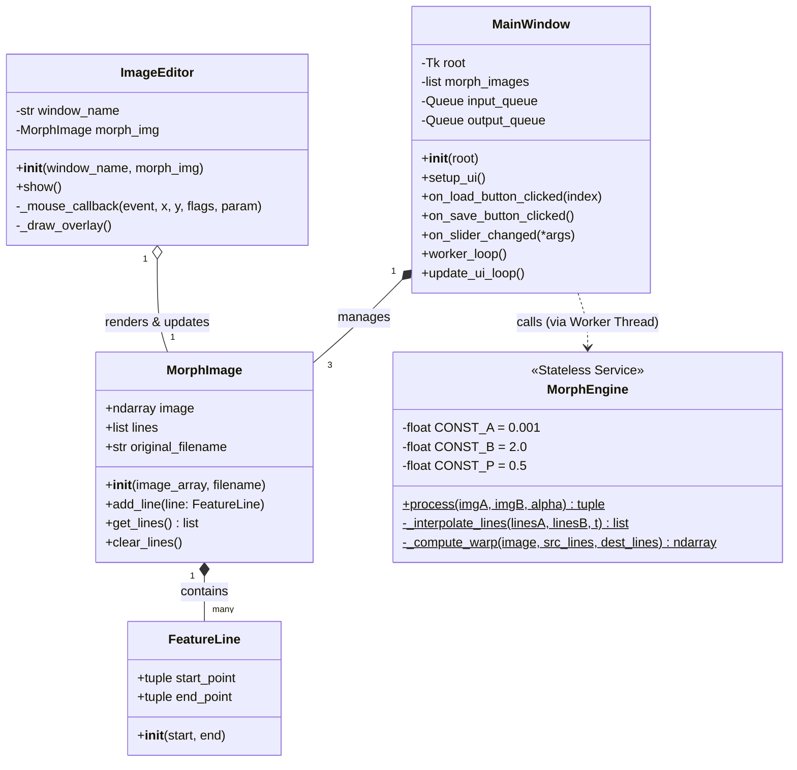
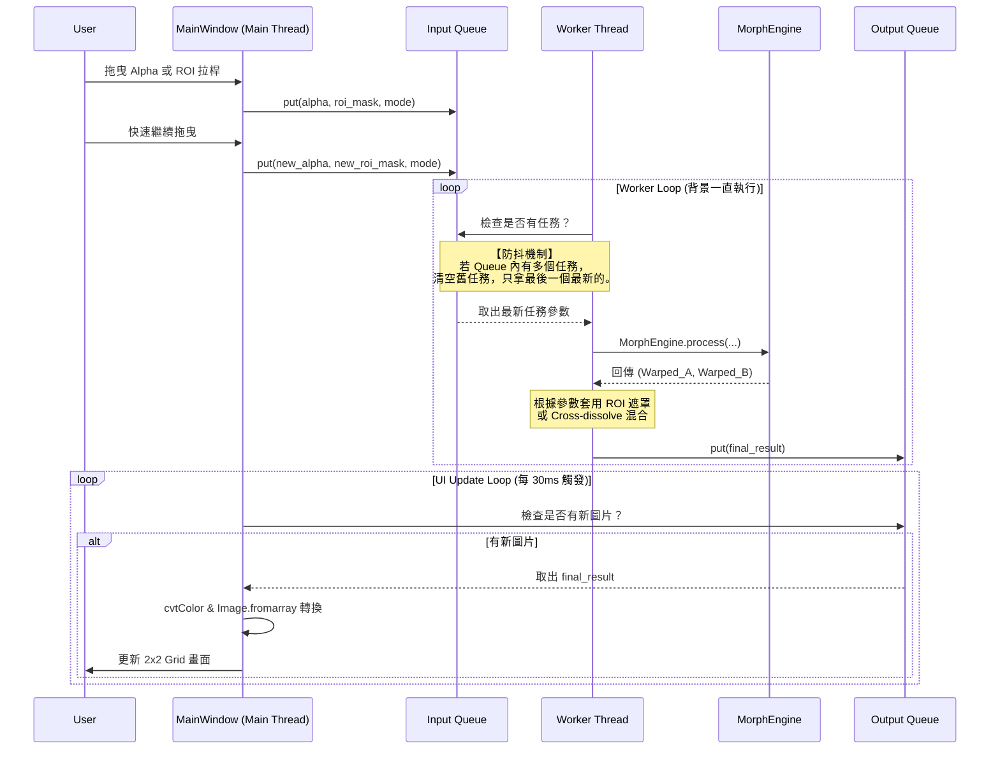

# HW2 報告

## 1. 環境
- **核心語言**：Python (版本需求 3.10 以上)
- **影像處理與 GUI**：OpenCV (`opencv-python>=4.8.0`)、Pillow (`Pillow>=10.0.0`)、Tkinter
- **矩陣運算核心**：NumPy (`numpy>=1.24.0`)
- **GPU 加速 (選配)**：CuPy (`cupy-cuda12x>=12.0.0`)，系統具備 NVIDIA GPU 時將自動切換加速
- **OS**：windows 11

---

## 2. 方法說明

### 類別與方法規格

#### 1. `FeatureLine` (純幾何資料)
* **屬性**: `start_point` (tuple), `end_point` (tuple)。代表方向性 (start $\to$ end)。
* **方法**: `__init__(self, start_point, end_point)`。

#### 2. `MorphImage` (影像與特徵線容器)
此類別需可被 `pickle` 序列化。
* **屬性**: `image` (numpy.ndarray), `lines` (list of FeatureLine), `original_filename` (str) 用於儲存時作為預設檔名。
* **方法**: `__init__(self, image, original_filename)`, `add_line(self, line)`, `get_lines(self) -> list`, `clear_lines(self)`。

#### 3. `MorphEngine` (無狀態變形引擎)
**引擎內部定義演算法常數：`a = 0.001`, `b = 2.0`, `p = 0.5`。** 具備模組自動偵測機制（自動切換 CuPy 或 NumPy）。不儲存實例狀態，不處理 ROI 與輸出模式。
* **方法**:
  * `process(imgA: MorphImage, imgB: MorphImage, alpha: float) -> tuple` (靜態): 負責調度內插與 Warping，回傳 `(Warped_A, Warped_B)`。
  * `_interpolate_lines(linesA: list, linesB: list, t: float) -> list` (靜態): 回傳過渡特徵線清單。
  * `_compute_warp(image: ndarray, src_lines: list, dest_lines: list) -> ndarray` (靜態): 核心演算法，套用常數計算 $X'$ 並使用 `cv2.remap` 取樣。

#### 4. `ImageEditor` (OpenCV 畫布控制器)
* **屬性**: `window_name` (str), `morph_img` (MorphImage)。
* **方法**: `__init__`, `show` (**實作事件迴圈，持續監聽 `Enter` 鍵與視窗關閉事件，於關閉時確保將 Feature Line 存入物件中**), `_mouse_callback`, `_draw_overlay` (繪製帶有方向性的箭頭，動態決定顏色並繪製文字標籤)。

#### 5. `MainWindow` (Tkinter 主視窗與執行緒管理)
負責建構 UI，調度「多執行緒防抖機制」，**負責處理 CLI 參數、資料夾選取、計算 Region of Interest Mask (ROI Mask) 與最終影像拼貼**。
* **屬性**: `morph_images` (list), `input_queue`, `output_queue` (queue.Queue)。
* **方法**:
  * `setup_ui(self)`: 繪製元件與 2x2 Grid。
  * `on_load_button_clicked(self, index)`: 判斷該槽位是否已存在資料，開啟檔案對話框或直接呼叫 `ImageEditor` 顯示圖片。
  * `on_save_button_clicked(self)`: 開啟資料夾選擇對話框，以 `original_filename` 儲存 `.pkl`。
  * `on_slider_changed(self, *args)`: **通用事件**。將最新 Alpha、ROI 座標與 mode 打包放進 `input_queue`。
  * `worker_loop(self)`: 監聽 `input_queue`，**清空舊任務 (LIFO)**。呼叫引擎取得 Warped 影像後，在此方法內套用 ROI 遮罩邏輯，將副本放進 `output_queue`。
  * `update_ui_loop(self)`: 每 30ms 輪詢更新畫面。
  
### 系統類圖


---

## 3. 程式執行

### 環境建置
```bash
# 建立並啟動虛擬環境 (以 Windows 為例)
python -m venv venv
.\venv\Scripts\activate

# 安裝依賴套件
pip install -r requirements.txt
```

### 啟動程式
可直接啟動
```bash
python main.py
```

或透過命令列參數預先載入圖片與標記檔 (`.pkl`)：
```bash
python main.py --slot1 "imageA.jpg" --slot2 "imageB.pkl"
```

---

## 4. 程式流程

運作流程分為「前期準備」與「即時預覽核心流程」。在使用者進入拉桿調整之前，系統會先完成圖檔與特徵線的初始化；進入調整階段後，則透過多執行緒架構進行高效率的即時渲染。

### I. 前期準備：影像載入與特徵標記
在進入下方的即時運算迴圈前，系統必須先備妥影像資料：
* **影像載入與狀態還原**
    * **多元格式支援**：程式支援載入一般圖檔或帶有特徵線資料的 `.pkl` 檔。
    * **Pickle 序列化**：透過 `pickle` 模組，系統可將 `MorphImage` 物件（包含像素矩陣、特徵線、原始檔名）完整儲存或還原，避免使用者每次開啟都要重複標記特徵線的繁瑣過程。
* **特徵線標記**
    * **即時編輯器**：點擊圖片槽位後會開啟 `ImageEditor`。使用者可隨時新增特徵線，並在按下 `Enter` 或關閉視窗時，系統會自動將畫好的線段資料寫回記憶體中的圖片物件。

### II. 即時預覽核心流程

當影像與特徵線準備就緒，使用者開始操作介面時，系統便會啟動以下多執行緒防抖與即時計算流程：



1.  **使用者操作與任務排程**
    * **防抖與任務調度**：當使用者 (`User`) 拖曳 Alpha 或 ROI 拉桿時，主執行緒 (`MainWindow`) 會立刻將當前的參數打包，推入輸入佇列 `input_queue` 中。若使用者快速連續拖曳，佇列中會瞬間堆積多個任務。
2.  **防抖機制與取出任務**
    * **Debouncing 機制**：背景執行緒 (`Worker Thread`) 持續在背景運行。當它去檢查 `input_queue` 時，如果發現有多個任務，它會**直接清空舊有積壓的任務，只取出「最後一個最新」的參數**進行運算，確保操作反應靈敏，UI 絕對不會卡頓。
3.  **變形運算與 GPU 加速**
    * **GPU 運算流**：Worker 將最新參數交給變形引擎 `MorphEngine`。引擎內部會利用 CuPy 進行向量化運算，計算各像素受特徵線影響的位移向量，最後透過 `cv2.remap` 進行亞像素採樣，並將扭曲好的兩張影像 (`Warped_A`, `Warped_B`) 回傳給 Worker。
4.  **Region of Interest (ROI) 融合與畫面渲染**
    * **局部平滑處理**：Worker 收到影像後，會根據參數決定融合方式。若啟用 ROI 模式，系統會根據設定的座標生成 Mask 矩陣，並強制套用 `cv2.GaussianBlur` 進行邊緣模糊處理，以確保變形區域與原始背景能自然融合；若無啟用則直接進行 Cross-dissolve 混合。
    * **畫面合成與輸出**：完成 Warping 與 ROI 拼貼後，Worker 會將最終成品 (`final_result`) 放入輸出佇列 `output_queue`。
5.  **UI 畫面刷新**
    * 主執行緒的 UI Update Loop 每 30ms 會觸發一次，檢查 `output_queue` 是否有新圖片。一旦發現新圖片，便會將其取出，經過 `cvtColor` 與 `Image.fromarray` 轉換為 Tkinter 支援的格式，最後更新到使用者的 2x2 Grid 畫面上。

---

## 5. 加分項（Bonus）

### 1. 可自己畫 feature line
使用者可透過滑鼠直接在圖片上拖曳定義特徵線，並具備箭頭方向輔助、自動配對顏色與標註序號功能，提升標記效率。

### 2. 可實時手動調整 alpha 值
主介面提供解析度達 0.01 的 Alpha 拉桿，範圍支援從 0.00 到 2.00。配合多執行緒架構，使用者在拖曳拉桿時，預覽畫面會即時呈現變形過程，無需等待計算完成後才更新。

### 3. 三張圖的 morphing animation
支援同時載入三張圖片進行連續變形控制。當 Alpha 在 0~1 之間時，呈現圖片 1 與 2 的 Morphing；Alpha 在 1~2 之間時，則自動切換為圖片 2 與 3 的變形過程。

### 4. 局部變形 (ROI)
實作區域變形控制功能。使用者可自訂變形範圍，並透過高斯模糊技術柔化變形邊緣。此功能允許在保留原圖背景的情況下，僅對特定區域進行 Beier-Neely 變形處理。
