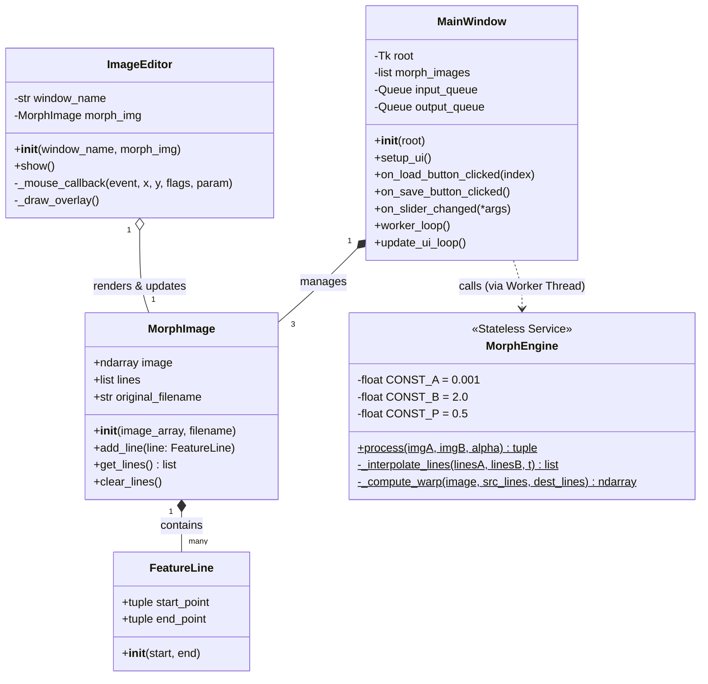
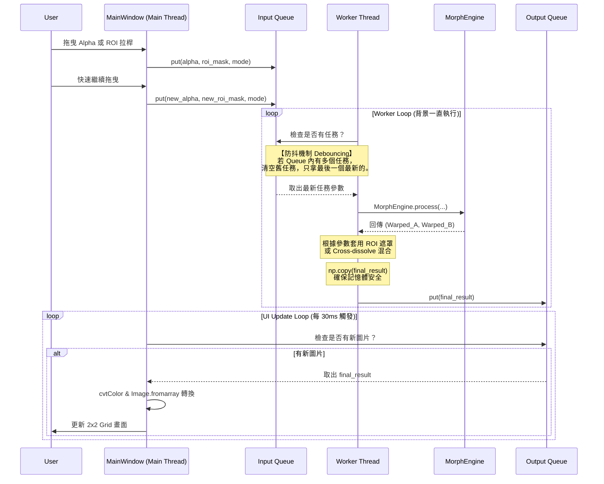

# Image Morphing SDD

## 1. 系統環境與部署

* **核心語言**：Python (版本需求 **3.10 以上**)
* **資料序列化**：使用 Python 內建 `pickle` 模組處理物件狀態的儲存與讀取。

### 建置與啟動方式 (Setup)
請於終端機執行以下指令進行環境建置：
```bash
# 建立虛擬環境
python -m venv venv

# macOS / Linux 啟動虛擬環境
source venv/bin/activate
# Windows 啟動虛擬環境
# .\venv\Scripts\activate

# 安裝依賴
pip install -r requirements.txt
```

### Requirements (`requirements.txt`)
* `opencv-python>=4.8.0`：負責 UI 顯示、滑鼠互動、影像讀取，以及高效的 `cv2.remap` 邊界保護運算。
* `numpy>=1.24.0`：負責 CPU 矩陣向量化運算核心與多執行緒資料拷貝。
* `cupy-cuda12x>=12.0.0` (選配)：若環境具備 NVIDIA GPU，可安裝對應 CUDA 版本的 CuPy。系統會自動偵測，若有安裝則切換至 GPU 加速，否則降級使用 NumPy。
* `Pillow>=10.0.0`：負責 Tkinter 與 OpenCV 之間的影像格式轉換。
* `tkinter`：Python 內建的標準 GUI 函式庫（Windows/macOS 安裝 Python 時已預設內建；若為 Linux 環境，可能需要透過系統指令額外安裝，例如 `sudo apt install python3-tk`）。

### 發佈打包 (PyInstaller)
* `pyinstaller --onefile --windowed --name "ImageMorpher" main.py`

---

## 2. 系統執行流程與 GUI 規劃

### 命令列參數 (CLI)
* 支援輸入圖片路徑（`.jpg`, `.png`）或已標記特徵線的 Pickle 檔（`.pkl`）。
* **指定槽位讀取**：在命令列傳入檔案時，需能明確指定該檔案對應的是第幾張圖（例如：圖 1、圖 2 或 圖 3）。
* 支援混搭讀取（例如圖 1 傳入 `.jpg`，圖 2 傳入 `.pkl`，圖 3 留空）。

### 主控制視窗 (Tkinter)
* **圖片載入**：三個按鈕分別對應圖片 1, 2, 3。
  * **未載入狀態**：若該槽位尚未有圖片（未從命令列傳入），點擊按鈕可開啟檔案總管載入新圖片。
  * **已載入狀態**：若該槽位已有圖片（包含單純圖檔或帶有 Feature Line 的 `.pkl`），點擊按鈕會顯示該圖片的 OpenCV 視窗，供使用者查看。**不管先前有無畫過 Feature Line，皆可隨時在視窗上繼續新增 Feature Line。**
* **儲存按鈕**：匯出當前的 `MorphImage` 為 `.pkl` 檔。**儲存時會直接預設以「圖片原本的檔名」命名，並彈出視窗讓使用者選擇/輸入要儲存的目標資料夾。**
* **變形控制 (Alpha)**：Alpha 值拉桿，範圍為 **0.00 ~ 2.00**，強制設定解析度為 0.01。
* **ROI 局部變形控制**：包含 Checkbox 控制開關，以及兩組動態對齊圖片解析度的 X-Y 拉桿。
* **執行與即時預覽**：拉動拉桿時不阻擋畫面，透過 Producer-Consumer 多執行緒架構交由背景運算。

### 標記特徵線 (OpenCV 子視窗)
* 點擊「圖片載入」按鈕後，彈出 OpenCV 視窗拖曳標記特徵線。
* **箭頭視覺輔助**：`ImageEditor` 在畫線時，**會以「箭頭」的形式（從 start 指向 end）繪製**，以明確表示特徵線的方向性。同時會根據線段 Index 動態決定顏色並標註序號。
* **儲存與關閉機制**：使用者完成繪製後，可直接按下鍵盤的 `Enter` 鍵，或是點擊 OpenCV 視窗右上角的「關閉 (X) 按鈕」來結束標記。系統會在此時自動確認並將所有新繪製的 Feature Line 存入圖檔資料中。

### 執行結果顯示 (2x2 Grid 合併視窗)
* **左上 (Slot 1)**：圖 1 變形結果（若 Alpha 不在 0~1，顯示原圖 1）。
* **右上 (Slot 2)**：圖 2 變形結果。
* **左下 (Slot 3)**：圖 3 變形結果（若 Alpha 不在 1~2，顯示原圖 3）。
* **右下 (Slot 4)**：最終 Morphing 結果。

---

## 3. 系統類別圖與 API 規格 (Class & Method Specifications)

### 系統類圖 (Class Diagram)


### 類別與方法規格字典 (API Dictionary)

#### 1. `FeatureLine` (純幾何資料)
* **屬性**: `start_point` (tuple), `end_point` (tuple)。代表方向性 (start $\to$ end)。
* **方法**: `__init__(self, start_point, end_point)`。

#### 2. `MorphImage` (影像與特徵線容器)
此類別需可被 `pickle` 序列化。
* **屬性**: `image` (numpy.ndarray), `lines` (list of FeatureLine), `original_filename` (str) 用於儲存時作為預設檔名。
* **方法**: `__init__(self, image, original_filename)`, `add_line(self, line)`, `get_lines(self) -> list`, `clear_lines(self)`。

#### 3. `MorphEngine` (無狀態變形引擎)
**引擎內部定義演算法常數：`a = 0.001`, `b = 2.0`, `p = 0.5`。** 具備模組自動偵測機制（自動切換 CuPy 或 NumPy）。不儲存實例狀態，不處理 ROI 與輸出模式。
* **方法**:
  * `process(imgA: MorphImage, imgB: MorphImage, alpha: float) -> tuple` (靜態): 負責調度內插與 Warping，回傳 `(Warped_A, Warped_B)`。
  * `_interpolate_lines(linesA: list, linesB: list, t: float) -> list` (靜態): 回傳過渡特徵線清單。
  * `_compute_warp(image: ndarray, src_lines: list, dest_lines: list) -> ndarray` (靜態): 核心演算法，套用常數計算 $X'$ 並使用 `cv2.remap` 取樣。

#### 4. `ImageEditor` (OpenCV 畫布控制器)
* **屬性**: `window_name` (str), `morph_img` (MorphImage)。
* **方法**: `__init__`, `show` (**實作事件迴圈，持續監聽 `Enter` 鍵與視窗關閉事件，於關閉時確保將 Feature Line 存入物件中**), `_mouse_callback`, `_draw_overlay` (繪製帶有方向性的箭頭，動態決定顏色並繪製文字標籤)。

#### 5. `MainWindow` (Tkinter 主視窗與執行緒管理)
負責建構 UI，調度「多執行緒防抖機制」，**負責處理 CLI 參數、資料夾選取、計算 ROI Mask 與最終影像拼貼**。
* **屬性**: `morph_images` (list), `input_queue`, `output_queue` (queue.Queue)。
* **方法**:
  * `setup_ui(self)`: 繪製元件與 2x2 Grid。
  * `on_load_button_clicked(self, index)`: 判斷該槽位是否已存在資料，開啟檔案對話框或直接呼叫 `ImageEditor` 顯示圖片。
  * `on_save_button_clicked(self)`: 開啟資料夾選擇對話框，以 `original_filename` 儲存 `.pkl`。
  * `on_slider_changed(self, *args)`: **通用事件**。將最新 Alpha、ROI 座標與 mode 打包放進 `input_queue`。
  * `worker_loop(self)`: 監聽 `input_queue`，**清空舊任務 (LIFO)**。呼叫引擎取得 Warped 影像後，在此方法內套用 ROI 遮罩邏輯，將副本放進 `output_queue`。
  * `update_ui_loop(self)`: 每 30ms 輪詢更新畫面。

---

## 4. 多執行緒與即時預覽架構 (Multithreading Architecture)

### 即時預覽時序圖 (Sequence Diagram)


---

## 5. 核心演算法與 ROI 變形邏輯

### Beier-Neely 演算法公式
* **Step 1. 座標投影與距離計算**：
  $$u = \frac{(X-P) \cdot (Q-P)}{||Q-P||^2}$$
  $$v = \frac{(X-P) \cdot \text{Perpendicular}(Q-P)}{||Q-P||}$$
* **Step 2. 多線段權重混合**：
  $$weight = \left( \frac{length^p}{a + dist} \right)^b$$
  $$X' = X + \frac{DSUM}{weightsum}$$
* **Step 3. 邊界保護映射**：強制套用 `cv2.remap` 自動解決亞像素內插與邊界超出問題。

### 局部變形 (ROI Warped Splicing) 邏輯
設定目前操作為 `Img_A` 與 `Img_B` (進度比例為 $t$)，**邏輯於 MainWindow 的 Worker Thread 執行**：
* **Warping 階段**：取得 `Warped_A` 與 `Warped_B`。
* **輸出模式判斷**：
  * **一般融合 (Checkbox 關閉)**：$\text{Result} = \text{Warped\_A} \cdot (1 - t) + \text{Warped\_B} \cdot t$
  * **ROI 局部變形 (Checkbox 開啟)**：
    1. 產生 Alpha Mask 矩陣 (由拉桿定義座標)。
    2. 使用 `cv2.GaussianBlur` 模糊化邊緣。
    3. 套用 $\text{Result} = \text{Warped\_B} \cdot \text{Mask} + \text{Warped\_A} \cdot (1 - \text{Mask})$ 拼貼。
