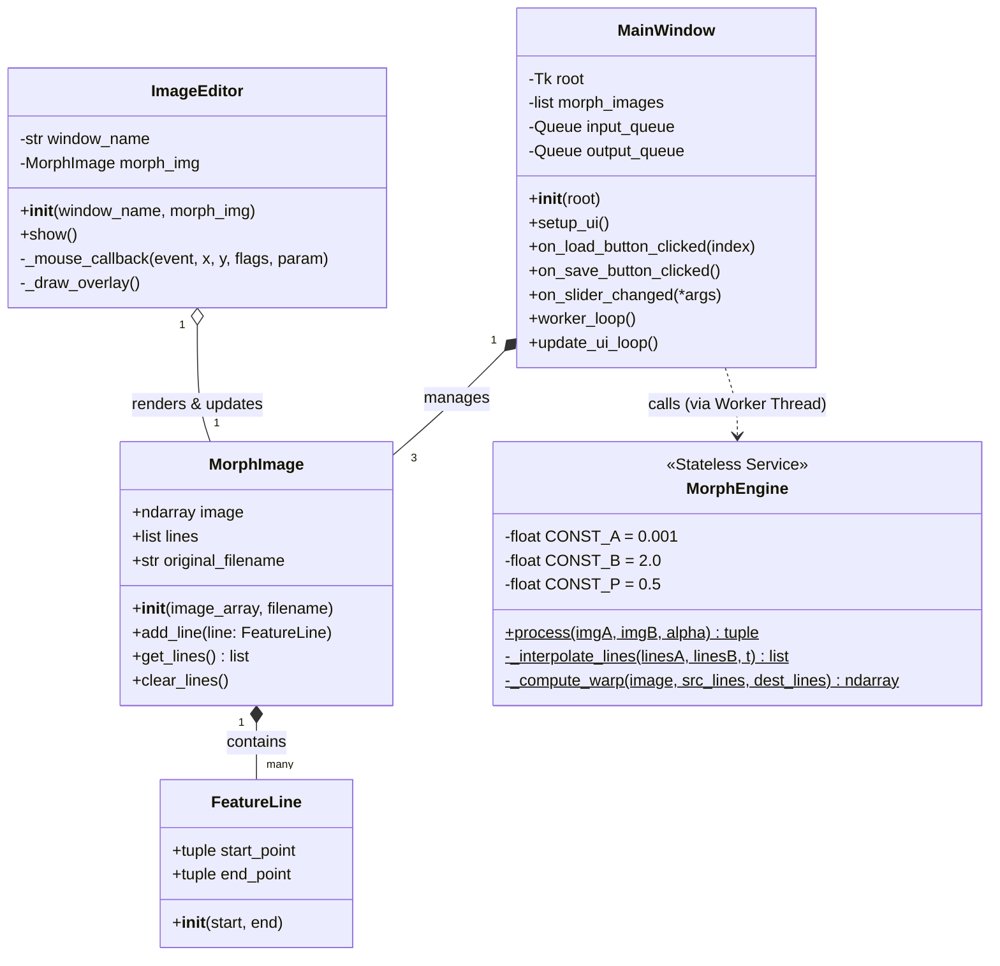
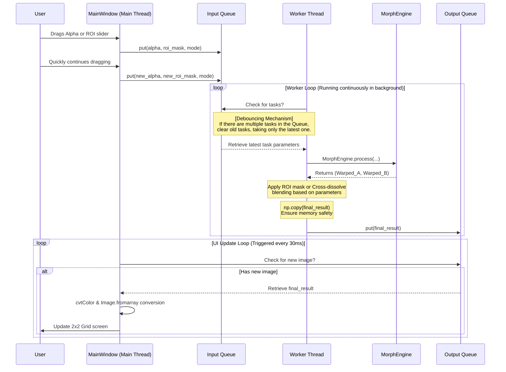

# Image Morphing SDD

## 1. System Environment and Deployment

* **Core Language**: Python (Version requirement **3.10 or higher**)
* **Data Serialization**: Uses Python's built-in `pickle` module to handle saving and loading of object states.

### Setup and Initialization
Run the following commands in the terminal to set up the environment:
```bash
# Create a virtual environment
python -m venv venv

# macOS / Linux: Activate the virtual environment
source venv/bin/activate
# Windows: Activate the virtual environment
# .\venv\Scripts\activate

# Install dependencies
pip install -r requirements.txt
```

### Requirements (`requirements.txt`)
* `opencv-python>=4.8.0`: Responsible for UI display, mouse interaction, image reading, and efficient `cv2.remap` boundary protection computation.
* `numpy>=1.24.0`: Responsible for CPU matrix vectorized computation core and multi-threaded data copying.
* `cupy-cuda12x>=12.0.0` (Optional): If an NVIDIA GPU is available, the corresponding CUDA version of CuPy can be installed. The system features an auto-detection mechanism; if installed, it switches to GPU acceleration, otherwise it falls back to NumPy.
* `Pillow>=10.0.0`: Responsible for image format conversion between Tkinter and OpenCV.
* `tkinter`: Python's built-in standard GUI library (Pre-installed by default when installing Python on Windows/macOS; on Linux environments, it may require manual installation via system commands, e.g., `sudo apt install python3-tk`).

### Packaging and Deployment (PyInstaller)
* `pyinstaller --onefile --windowed --name "ImageMorpher" main.py`

---

## 2. System Execution Flow and GUI Planning

### Command Line Interface (CLI)
* Supports inputting image paths (e.g., `.jpg`, `.png`) or Pickle files with marked feature lines (`.pkl`).
* **Specify Slot Loading**: When passing files via the command line, you must explicitly specify which slot the file corresponds to (e.g., Image 1, Image 2, or Image 3).
* Supports mixed loading (e.g., passing a `.jpg` for Image 1, a `.pkl` for Image 2, and leaving Image 3 empty).

### Main Control Window (Tkinter)
* **Image Loading**: Three buttons corresponding to Images 1, 2, and 3.
  * **Unloaded State**: If the slot does not yet have an image (not passed from CLI), clicking the button opens the file explorer to load a new image.
  * **Loaded State**: If the slot already has an image (whether a plain image file or a `.pkl` with Feature Lines), clicking the button displays the OpenCV window for that image for the user to view. **Regardless of whether Feature Lines were drawn previously, new Feature Lines can be added at any time in the window.**
* **Save Button**: Exports the current `MorphImage` as a `.pkl` file. **When saving, it defaults to the "original filename of the image" and pops up a dialog allowing the user to select/input the target folder.**
* **Morphing Control (Alpha)**: Alpha value slider, range **0.00 ~ 2.00**, strictly set to a resolution of 0.01.
* **ROI Local Morphing Control**: Contains a Checkbox to toggle the feature, and two sets of X-Y sliders dynamically aligned with the image resolution.
* **Execution and Real-time Preview**: Dragging the slider does not block the UI screen update; it utilizes a Producer-Consumer multithreaded architecture to offload computation to the background.

### Feature Line Marking (OpenCV Sub-window)
* After clicking the "Image Loading" button, an OpenCV window pops up to drag and mark feature lines.
* **Arrow Visual Aid**: When drawing a line, `ImageEditor` **draws it as an "arrow" (pointing from start to end)** to clearly indicate the directionality of the feature line. It also dynamically determines the color and labels the index based on the line segment's Index.
* **Save and Close Mechanism**: After the user finishes drawing, they can directly press the `Enter` key on the keyboard or click the "Close (X) button" in the top right corner of the OpenCV window to finish marking. The system will automatically confirm and save all newly drawn Feature Lines into the image data at this time.

### Execution Results Display (2x2 Grid Merged Window)
* **Top Left (Slot 1)**: Image 1 warped result (If Alpha is not between 0~1, display original Image 1).
* **Top Right (Slot 2)**: Image 2 warped result.
* **Bottom Left (Slot 3)**: Image 3 warped result (If Alpha is not between 1~2, display original Image 3).
* **Bottom Right (Slot 4)**: Final Morphing Result.

---

## 3. System Class Diagram and API Specifications

### Class Diagram


### Class and Method API Dictionary

#### 1. `FeatureLine` (Pure Geometric Data)
* **Attributes**: `start_point` (tuple), `end_point` (tuple). Represents directionality (start $\to$ end).
* **Methods**: `__init__(self, start_point, end_point)`.

#### 2. `MorphImage` (Image and Feature Line Container)
This class must be serializable via `pickle`.
* **Attributes**: `image` (numpy.ndarray), `lines` (list of FeatureLine), `original_filename` (str) used as the default filename when saving.
* **Methods**: `__init__(self, image, original_filename)`, `add_line(self, line)`, `get_lines(self) -> list`, `clear_lines(self)`.

#### 3. `MorphEngine` (Stateless Morphing Engine)
**The engine internally defines algorithm constants: `a = 0.001`, `b = 2.0`, `p = 0.5`.** Features a module auto-detection mechanism (automatically switches between CuPy or NumPy). Does not store instance state, and does not process ROI or output modes.
* **Methods**:
  * `process(imgA: MorphImage, imgB: MorphImage, alpha: float) -> tuple` (Static): Responsible for dispatching interpolation and Warping, returns `(Warped_A, Warped_B)`.
  * `_interpolate_lines(linesA: list, linesB: list, t: float) -> list` (Static): Returns the list of transitional feature lines.
  * `_compute_warp(image: ndarray, src_lines: list, dest_lines: list) -> ndarray` (Static): Core algorithm, applies constants to calculate $X'$ and uses `cv2.remap` for sampling.

#### 4. `ImageEditor` (OpenCV Canvas Controller)
* **Attributes**: `window_name` (str), `morph_img` (MorphImage).
* **Methods**: `__init__`, `show` (**Implements an event loop, continuously listening for the `Enter` key and window close events, ensuring Feature Lines are saved into the object upon closing**), `_mouse_callback`, `_draw_overlay` (draws directional arrows, dynamically determines colors and draws text labels).

#### 5. `MainWindow` (Tkinter Main Window and Thread Manager)
Responsible for building the UI, dispatching the "Multithreaded Debouncing Mechanism", and **handling CLI parameters, folder selection, ROI Mask calculations, and final image splicing**.
* **Attributes**: `morph_images` (list), `input_queue`, `output_queue` (queue.Queue).
* **Methods**:
  * `setup_ui(self)`: Renders components and the 2x2 Grid.
  * `on_load_button_clicked(self, index)`: Determines if the slot already contains data; opens a file dialog or directly calls `ImageEditor` to display the image.
  * `on_save_button_clicked(self)`: Opens a folder selection dialog and saves `.pkl` using `original_filename`.
  * `on_slider_changed(self, *args)`: **Universal event**. Packs the latest Alpha, ROI coordinates, and mode into the `input_queue`.
  * `worker_loop(self)`: Listens to the `input_queue` and **clears old tasks (LIFO)**. Calls the engine to get Warped images, applies ROI mask logic within this method, and puts a copy into the `output_queue`.
  * `update_ui_loop(self)`: Polls every 30ms to update the screen.

---

## 4. Multithreading and Real-time Preview Architecture

### Real-time Preview Sequence Diagram


---

## 5. Core Algorithm and ROI Morphing Logic

### Beier-Neely Algorithm Formulas
* **Step 1. Coordinate Projection and Distance Calculation**:
  $$u = \frac{(X-P) \cdot (Q-P)}{||Q-P||^2}$$
  $$v = \frac{(X-P) \cdot \text{Perpendicular}(Q-P)}{||Q-P||}$$
* **Step 2. Multiple Line Weighting**:
  $$weight = \left( \frac{length^p}{a + dist} \right)^b$$
  $$X' = X + \frac{DSUM}{weightsum}$$
* **Step 3. Boundary Protection Mapping**: Force the use of `cv2.remap` to automatically resolve sub-pixel interpolation and out-of-bounds issues.

### Local Morphing (ROI Warped Splicing) Logic
Assume the current operation is on `Img_A` and `Img_B` (progress ratio is $t$). **The following logic is executed in the Worker Thread of MainWindow**:
* **Warping Phase**: Obtain `Warped_A` and `Warped_B`.
* **Output Mode Determination**:
  * **Standard Blending (Checkbox Off)**: $\text{Result} = \text{Warped\_A} \cdot (1 - t) + \text{Warped\_B} \cdot t$
  * **ROI Local Morphing (Checkbox On)**:
    1. Generate an Alpha Mask matrix (coordinates defined by sliders).
    2. Use `cv2.GaussianBlur` to blur edges.
    3. Apply splicing: $\text{Result} = \text{Warped\_B} \cdot \text{Mask} + \text{Warped\_A} \cdot (1 - \text{Mask})$.
