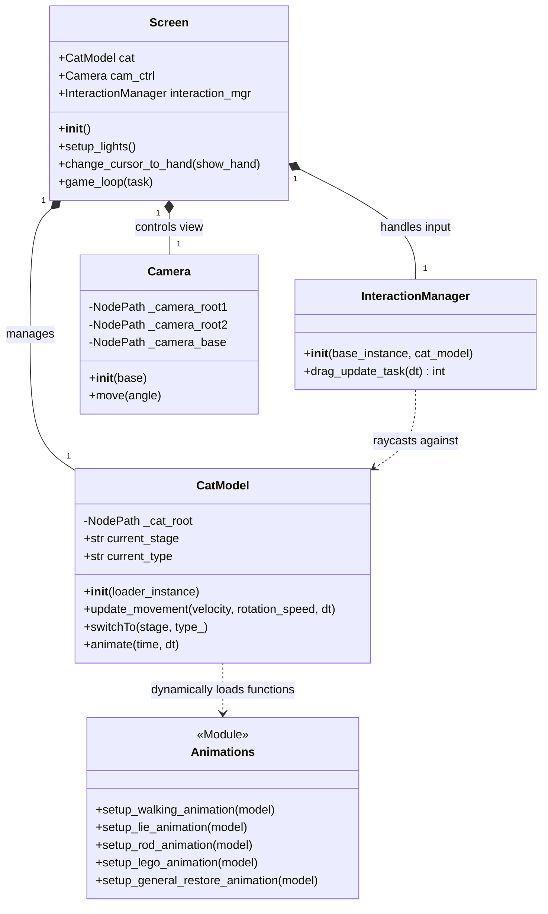
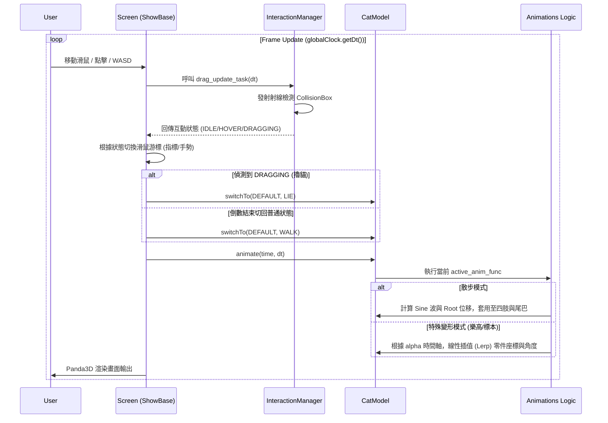
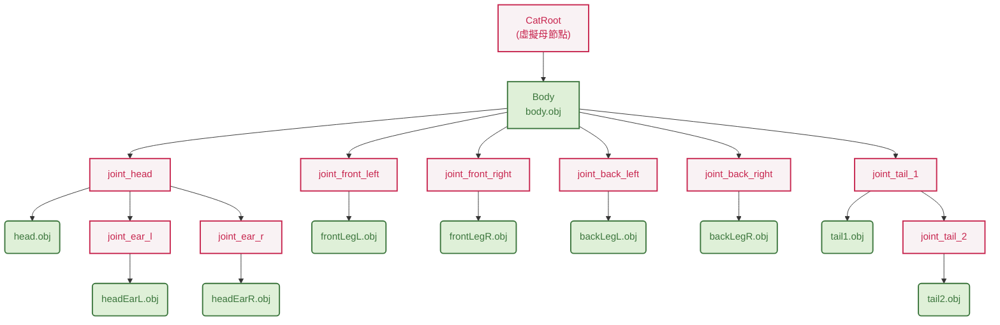
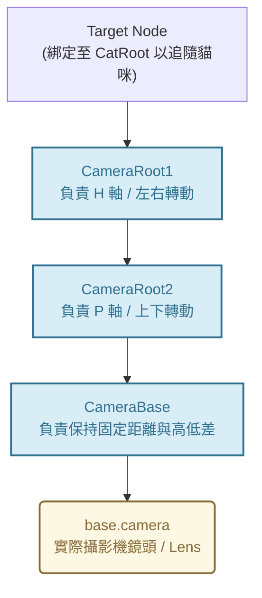

# HW3 報告

## 1. 環境
- **核心語言**：Python (建議版本 3.10.20 以上)
- **程式庫**：Panda3D (`panda3d>=1.10.16`)
- **模型格式**：`.obj` 靜態 3D 模型
- **OS**：Windows 11

---

## 2. 方法說明

#### 1. `CatModel` (貓咪模型與動畫)
負責管理 3D 零件載入、`Scene Graph` 階層綁定，以及基於數學運算的程式化動畫。
* **屬性**: `_cat_root` (虛擬根節點), `body`, `head`, `tail_1`, `tail_2`, `leg_fl` 等 (各零件節點與關節), `current_stage`, `current_type` (當前動畫狀態)。
* **方法**:
  * `__init__(self, loader_instance)`: 初始化階層樹，讀取 `.obj` 並擺放至適當位置與綁定材質。
  * `update_movement(self, velocity, rotation_speed, dt)`: 處理貓咪的移動與轉向。
  * `switchTo(self, stage, type_)`: 切換狀態機，重新指派並初始化當前的動畫函式 (例如切換至標本或樂高模式)。
  * `animate(self, time, dt)`: 每幀由主迴圈呼叫，執行當前狀態下的動畫。

#### 2. `InteractionManager` (滑鼠碰撞與互動偵測)
利用 Raycast 實作物理碰撞偵測，判定玩家對貓咪的互動狀態。
* **方法**:
  * `__init__(self, base_instance, cat_model)`: 綁定滑鼠事件，並在貓咪外層建立 `CollisionBox`。
  * `on_mouse_down(self)` / `on_mouse_up(self)`: 紀錄滑鼠按鍵點擊狀態。
  * `drag_update_task(self, dt)`: 辨識滑鼠狀態。利用射線檢查是否碰到貓，並透過滑鼠移動量來確定有在拖移。最後回傳當前滑鼠狀態。

#### 3. `Camera` (視角控制)
負責建構第三人稱環繞視角。
* **屬性**: `_camera_root1`, `_camera_root2`, `_camera_base` (多層虛擬節點)。
* **方法**:
  * `__init__(self, base)`: 將 Panda3D 預設相機掛載到自訂節點上，並設定 Perspective View，綁定 WASD 鍵盤事件。
  * `move(self, angle: Vec3)`: 分離 Z 軸 (Heading) 與 X 軸 (Pitch) 的旋轉並套用到不同層的虛擬節點上。

#### 4. `Screen` (主應用程式)
繼承自 Panda3D 的 `ShowBase`，負責統籌場景、燈光、事件捕捉與全局遊戲迴圈。
* **屬性**: `cat` (`CatModel` Instance), `cam_ctrl` (`Camera` Instance), `interaction_mgr` (`InteractionManager` Instance)。
* **方法**:
  * `__init__(self)`: 初始建構 3D 舞台、載入模型與啟動迴圈。
  * `setup_lights(self)` / `setup_ground(self)`: 設置環境光與平行光，以及地板。
  * `game_loop(self, task)`: 每幀觸發的核心 Task。讀取互動狀態、動態切換滑鼠游標 (指到貓變手)，並調度貓咪的行為與動畫更新。



---

## 3. 程式執行

### 環境建置
```bash
# 建立並啟動虛擬環境 (以 Windows 為例)
python -m venv venv
.\venv\Scripts\activate

# 安裝依賴套件
pip install -r requirements.txt
```

### 啟動程式
請確保 `assets/` 資料夾內備妥所有 `.obj` 模型與貼圖檔，接著直接執行主程式：
```bash
python main.py
```

---

## 4. 程式流程

運作流程分為「前期準備」與「遊戲互動迴圈」。

### I. 前期準備：場景建構與階層綁定

在渲染第一幀畫面之前，系統必須先建構好 3D 邏輯結構：

* **場景圖 (Scene Graph) 搭建**：`CatModel` 載入各個 `.obj` 零件後，精準計算 Offset，並將尾巴二節綁於第一節之下、四肢與頭部綁於身體之下，確保後續轉動時能產生正確的連動物理效果。
* **物理與視覺初始化**：載入並套用材質貼圖 (Texture)，設置平行光與環境光，並利用 `CollisionBox` 把貓咪實體包裹起來，供後續射線偵測使用。

### II. 即時互動核心流程 (Game Loop)



### III. Scene Graph Hierarchy

#### 1. 貓咪模型 Scene Graph

*(註：紅色節點為 Panda3D 中的虛擬 NodePath，用來控制旋轉軸心；綠色節點為實際載入的 3D 模型零件)*

#### 2. 攝影機視角階層圖 (Camera Scene Graph)
透過多層虛擬節點實現「目標追隨」、「左右轉動」、「上下轉動」以及「第三人稱視角」。


---

## 5. 作業要求

### 【Basic】移動與走路
* 透過 Sine 函數與相位差 (Phase Shift) 計算，讓直筒狀的四肢能自然交替擺動。
* 實作貓咪移動與隨機轉向機制。
* 尾巴分為兩層節點，透過些微的時間延遲做出波浪擺動感。

### 【Advance】貓咪棒狀標本
* 按下鍵盤 `2` 觸發。
* 在 2 秒內將四肢向前後水平伸直、尾巴拉直，呈現硬梆梆的標本狀態，並停止任何呼吸與位移動畫。

---

## 6. Bonus

### 1. 攝影機轉動與跟隨

使用自訂的虛擬節點架構實作了第三人稱視角。玩家可使用 `W`, `A`, `S`, `D` 按鍵以貓咪為中心進行環繞觀察，且攝影機焦點會永遠追隨貓咪的位置。

### 2. 攝影機透視投影 (Perspective View)

### 3. 模型貼圖

讀取 `tabby.png` 並關閉模糊濾鏡 (`Texture.FT_nearest`)，完美保留 Minecraft 特有的像素方塊風格，映射至 `.obj` 模型上。

### 4. 光影控制

建構了包含 Ambient Light (環境光) 與 Directional Light (平行太陽光) 的光影系統，使方塊產生立體明暗面。玩家可透過按下 `Space` (空白鍵) 即時開關平行光。

### 5. Advance 2：貓咪積木亂拆與重組 (Lego Mode)

* **拆卸**：按下 `3` 觸發。演算法將貓咪零件分為 Level 2 (頭、四肢) 與 Level 3 (耳朵、尾端) 兩階段拆除。零件會被亂數打散到固定的網格點上。
* **重組**：按下 `1` 觸發還原。不論零件散落於何處，系統會透過陣列紀錄並計算線性插值，在 2 秒內將所有積木精準吸回原位，無縫銜接回走路動畫。

### 6. 滑鼠擼貓互動

當滑鼠懸停於貓咪時，游標會自動變形為「手掌」圖示；當玩家按住滑鼠在貓咪身上拖曳 (擼貓) 時，會立刻觸發「趴地」動畫。貓咪會往 Z 軸下沉完美貼平地面，並甩動尾巴與身體起伏。

---

*模型設計與貼圖皆來自 minecraft*
*`hand_cursor.ico` 來自 flaticon*
